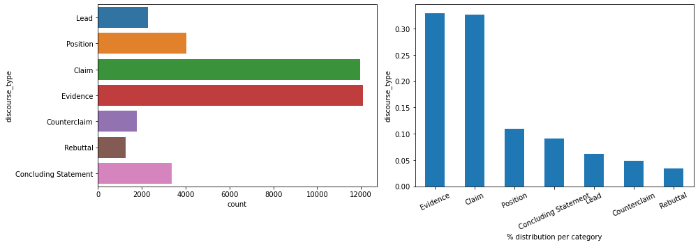
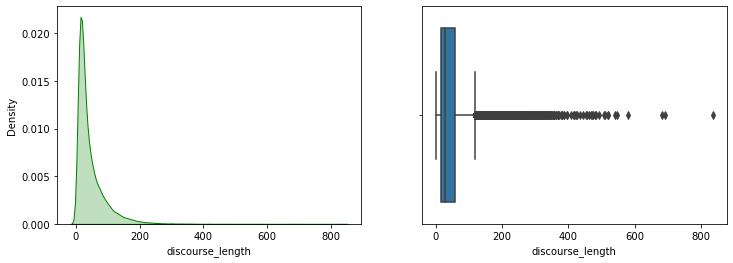
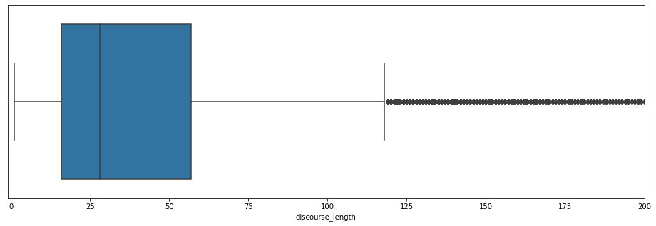
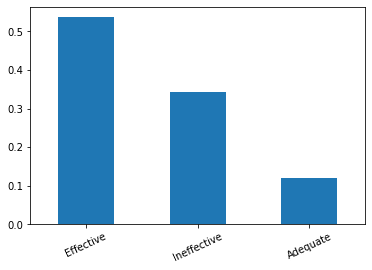

```python
import pandas as pd

df = pd.read_csv("train.csv")
df.shape
```


    (36765, 5)


```python
df.dtypes
```


    discourse_id               object
    essay_id                   object
    discourse_text             object
    discourse_type             object
    discourse_effectiveness    object
    dtype: object


```python
df.head()
```


<div>
<style scoped>
    .dataframe tbody tr th:only-of-type {
        vertical-align: middle;
    }

    .dataframe tbody tr th {
        vertical-align: top;
    }

    .dataframe thead th {
        text-align: right;
    }
</style>
<table border="1" class="dataframe">
  <thead>
    <tr style="text-align: right;">
      <th></th>
      <th>discourse_id</th>
      <th>essay_id</th>
      <th>discourse_text</th>
      <th>discourse_type</th>
      <th>discourse_effectiveness</th>
    </tr>
  </thead>
  <tbody>
    <tr>
      <th>0</th>
      <td>0013cc385424</td>
      <td>007ACE74B050</td>
      <td>Hi, i'm Isaac, i'm going to be writing about h...</td>
      <td>Lead</td>
      <td>Adequate</td>
    </tr>
    <tr>
      <th>1</th>
      <td>9704a709b505</td>
      <td>007ACE74B050</td>
      <td>On my perspective, I think that the face is a ...</td>
      <td>Position</td>
      <td>Adequate</td>
    </tr>
    <tr>
      <th>2</th>
      <td>c22adee811b6</td>
      <td>007ACE74B050</td>
      <td>I think that the face is a natural landform be...</td>
      <td>Claim</td>
      <td>Adequate</td>
    </tr>
    <tr>
      <th>3</th>
      <td>a10d361e54e4</td>
      <td>007ACE74B050</td>
      <td>If life was on Mars, we would know by now. The...</td>
      <td>Evidence</td>
      <td>Adequate</td>
    </tr>
    <tr>
      <th>4</th>
      <td>db3e453ec4e2</td>
      <td>007ACE74B050</td>
      <td>People thought that the face was formed by ali...</td>
      <td>Counterclaim</td>
      <td>Adequate</td>
    </tr>
  </tbody>
</table>
</div>


## **Univariate Analysis**

### **Target**


```python
import seaborn as sns
import matplotlib.pyplot as plt

stats_target = df['discourse_effectiveness'].value_counts(normalize=True)
print(stats_target)

plt.figure(figsize=(14,5))
plt.subplot(1,2,1)
sns.countplot(data=df,y='discourse_effectiveness')
plt.subplot(1,2,2)
stats_target.plot.bar(rot=25)
plt.ylabel('discourse_effectiveness')
plt.xlabel('% distribution per category')
plt.tight_layout()
plt.show()
```

    Adequate       0.570570
    Effective      0.253665
    Ineffective    0.175765
    Name: discourse_effectiveness, dtype: float64


### **Categorical Data**


```python
import seaborn as sns
import matplotlib.pyplot as plt

plt.figure(figsize=(14,5))
plt.subplot(1,2,1)
sns.countplot(data=df,y='discourse_type')
plt.subplot(1,2,2)
df['discourse_type'].value_counts(normalize=True).plot.bar(rot=25)
plt.ylabel('discourse_type')
plt.xlabel('% distribution per category')
plt.tight_layout()
plt.show()
```





### **NLP Data**

#### **Length Analysis**


```python
def length_disc(discourse_text):
    return len(discourse_text.split())

df['discourse_length'] = df['discourse_text'].apply(length_disc)
```


```python
df.head()
```


<div>
<style scoped>
    .dataframe tbody tr th:only-of-type {
        vertical-align: middle;
    }

    .dataframe tbody tr th {
        vertical-align: top;
    }

    .dataframe thead th {
        text-align: right;
    }
</style>
<table border="1" class="dataframe">
  <thead>
    <tr style="text-align: right;">
      <th></th>
      <th>discourse_id</th>
      <th>essay_id</th>
      <th>discourse_text</th>
      <th>discourse_type</th>
      <th>discourse_effectiveness</th>
      <th>discourse_length</th>
    </tr>
  </thead>
  <tbody>
    <tr>
      <th>0</th>
      <td>0013cc385424</td>
      <td>007ACE74B050</td>
      <td>Hi, i'm Isaac, i'm going to be writing about h...</td>
      <td>Lead</td>
      <td>Adequate</td>
      <td>67</td>
    </tr>
    <tr>
      <th>1</th>
      <td>9704a709b505</td>
      <td>007ACE74B050</td>
      <td>On my perspective, I think that the face is a ...</td>
      <td>Position</td>
      <td>Adequate</td>
      <td>41</td>
    </tr>
    <tr>
      <th>2</th>
      <td>c22adee811b6</td>
      <td>007ACE74B050</td>
      <td>I think that the face is a natural landform be...</td>
      <td>Claim</td>
      <td>Adequate</td>
      <td>21</td>
    </tr>
    <tr>
      <th>3</th>
      <td>a10d361e54e4</td>
      <td>007ACE74B050</td>
      <td>If life was on Mars, we would know by now. The...</td>
      <td>Evidence</td>
      <td>Adequate</td>
      <td>72</td>
    </tr>
    <tr>
      <th>4</th>
      <td>db3e453ec4e2</td>
      <td>007ACE74B050</td>
      <td>People thought that the face was formed by ali...</td>
      <td>Counterclaim</td>
      <td>Adequate</td>
      <td>18</td>
    </tr>
  </tbody>
</table>
</div>


```python
plt.figure(figsize=(12,4))
plt.subplot(1,2,1)
sns.kdeplot(df['discourse_length'],color='g',shade=True)
plt.subplot(1,2,2)
sns.boxplot(df['discourse_length'])
plt.show()
```

    /Users/tomkeldenich/opt/anaconda3/lib/python3.9/site-packages/seaborn/_decorators.py:36: FutureWarning: Pass the following variable as a keyword arg: x. From version 0.12, the only valid positional argument will be `data`, and passing other arguments without an explicit keyword will result in an error or misinterpretation.
      warnings.warn(





```python
plt.figure(figsize=(16,5))
ax = sns.boxplot(df['discourse_length'])
ax.set_xlim(-1, 200)
plt.show()
```

    /Users/tomkeldenich/opt/anaconda3/lib/python3.9/site-packages/seaborn/_decorators.py:36: FutureWarning: Pass the following variable as a keyword arg: x. From version 0.12, the only valid positional argument will be `data`, and passing other arguments without an explicit keyword will result in an error or misinterpretation.
      warnings.warn(





```python
print("Skew: {}".format(df['discourse_length'].skew()))
print("Kurtosis: {}".format(df['discourse_length'].kurtosis()))
```

    Skew: 2.9285198590138415
    Kurtosis: 15.61832354148293


##### **Outliers**


```python
from scipy.stats import zscore

y_outliers = df[abs(zscore(df['discourse_length'])) >= 3 ]
y_outliers
```


<div>
<style scoped>
    .dataframe tbody tr th:only-of-type {
        vertical-align: middle;
    }

    .dataframe tbody tr th {
        vertical-align: top;
    }

    .dataframe thead th {
        text-align: right;
    }
</style>
<table border="1" class="dataframe">
  <thead>
    <tr style="text-align: right;">
      <th></th>
      <th>discourse_id</th>
      <th>essay_id</th>
      <th>discourse_text</th>
      <th>discourse_type</th>
      <th>discourse_effectiveness</th>
      <th>discourse_length</th>
    </tr>
  </thead>
  <tbody>
    <tr>
      <th>99</th>
      <td>4a7d11406893</td>
      <td>01E9D9CD5CBF</td>
      <td>The study the ability of humans to read subatl...</td>
      <td>Evidence</td>
      <td>Ineffective</td>
      <td>222</td>
    </tr>
    <tr>
      <th>110</th>
      <td>d1c5f0d13151</td>
      <td>021663FD2F2E</td>
      <td>The Mona lisa demonstration really intended to...</td>
      <td>Evidence</td>
      <td>Ineffective</td>
      <td>209</td>
    </tr>
    <tr>
      <th>208</th>
      <td>4b1e4c493bfd</td>
      <td>0491C7BFA9B4</td>
      <td>Attention !!! to all the residents of this com...</td>
      <td>Evidence</td>
      <td>Ineffective</td>
      <td>353</td>
    </tr>
    <tr>
      <th>219</th>
      <td>1b263824b0b2</td>
      <td>04B4209D8A34</td>
      <td>Even if you have no experience with an of the ...</td>
      <td>Evidence</td>
      <td>Effective</td>
      <td>199</td>
    </tr>
    <tr>
      <th>293</th>
      <td>506f1d68d554</td>
      <td>071BF63AF332</td>
      <td>ubs and sports are very social activities. If ...</td>
      <td>Evidence</td>
      <td>Effective</td>
      <td>249</td>
    </tr>
    <tr>
      <th>...</th>
      <td>...</td>
      <td>...</td>
      <td>...</td>
      <td>...</td>
      <td>...</td>
      <td>...</td>
    </tr>
    <tr>
      <th>36577</th>
      <td>5c7052b1ac08</td>
      <td>F359E262A14A</td>
      <td>That is so important for me and my parents and...</td>
      <td>Evidence</td>
      <td>Ineffective</td>
      <td>234</td>
    </tr>
    <tr>
      <th>36620</th>
      <td>e6613c2ffde8</td>
      <td>F54BD89B665A</td>
      <td>Online courses do not give the opportunity for...</td>
      <td>Evidence</td>
      <td>Effective</td>
      <td>192</td>
    </tr>
    <tr>
      <th>36654</th>
      <td>b1f96b34280e</td>
      <td>F93D06BC99D8</td>
      <td>Generic_Name found out much later that she mad...</td>
      <td>Concluding Statement</td>
      <td>Effective</td>
      <td>257</td>
    </tr>
    <tr>
      <th>36689</th>
      <td>479fb02ae14b</td>
      <td>FD05FDCEA11B</td>
      <td>My footsteps seemed impossibly loud as I walke...</td>
      <td>Lead</td>
      <td>Effective</td>
      <td>542</td>
    </tr>
    <tr>
      <th>36722</th>
      <td>dc9995b62bb6</td>
      <td>FDF0AEEB14C3</td>
      <td>In conclusion, many people will argue that onl...</td>
      <td>Concluding Statement</td>
      <td>Effective</td>
      <td>215</td>
    </tr>
  </tbody>
</table>
<p>719 rows × 6 columns</p>
</div>


```python
stats_long_text = y_outliers['discourse_effectiveness'].value_counts(normalize=True)
print(stats_long_text)
stats_long_text.plot.bar(rot=25)
```

    Effective      0.536857
    Ineffective    0.342142
    Adequate       0.121001
    Name: discourse_effectiveness, dtype: float64


    <AxesSubplot:>





Right now a first hint emerge. Most of long discourse seems to be `Effective` about 53%. It is way more than the entire dataset (25%).

So we an dra a firs hypothesis : **the more a discourse is long, the more it seems `Effective`.**

But we can also see that it can be more frequently `Ineffective` (34%) than on with normal length discourse (17%).


```python
stats_long_text = y_outliers['discourse_type'].value_counts(normalize=True)
print(stats_long_text)
stats_long_text.plot.bar(rot=25)
```

    Evidence                0.933241
    Concluding Statement    0.034771
    Lead                    0.029207
    Counterclaim            0.001391
    Rebuttal                0.001391
    Name: discourse_type, dtype: float64


    <AxesSubplot:>


Here the statistic is very clear. Most of the long discourse is of type `Evidence`. 

But are `Evidence` discourse only long discourse ?

We'll see that in the Multivariate Analysis.

Right now let's continue with the words analysis!

#### **Words Analysis**

Here I'm copying pasting code from the tutorial [Preprocessing NLP – Tutorial to quickly clean up a text](https://inside-machinelearning.com/en/preprocessing-nlp-preprocessing/) and applying few change to it!


```python
import nltk
import string
from nltk.stem import WordNetLemmatizer

nltk.download('stopwords')
nltk.download('punkt')
nltk.download('words')
nltk.download('wordnet')

stopwords = nltk.corpus.stopwords.words('english')
words = set(nltk.corpus.words.words())
lemmatizer = WordNetLemmatizer()

def preprocessSentence(sentence):
    sentence_w_punct = "".join([i.lower() for i in sentence if i not in string.punctuation])

    sentence_w_num = ''.join(i for i in sentence_w_punct if not i.isdigit())

    tokenize_sentence = nltk.tokenize.word_tokenize(sentence_w_num)

    words_w_stopwords = [i for i in tokenize_sentence if i not in stopwords]

    words_lemmatize = (lemmatizer.lemmatize(w) for w in words_w_stopwords)

    sentence_clean = ' '.join(w for w in words_lemmatize if w.lower() in words or not w.isalpha())

    return sentence_clean.split()
```

    [nltk_data] Downloading package stopwords to
    [nltk_data]     /Users/tomkeldenich/nltk_data...
    [nltk_data]   Package stopwords is already up-to-date!
    [nltk_data] Downloading package punkt to
    [nltk_data]     /Users/tomkeldenich/nltk_data...
    [nltk_data]   Package punkt is already up-to-date!
    [nltk_data] Downloading package words to
    [nltk_data]     /Users/tomkeldenich/nltk_data...
    [nltk_data]   Package words is already up-to-date!
    [nltk_data] Downloading package wordnet to
    [nltk_data]     /Users/tomkeldenich/nltk_data...
    [nltk_data]   Package wordnet is already up-to-date!


```python
df.iloc[1]['discourse_text']
```


    "On my perspective, I think that the face is a natural landform because I dont think that there is any life on Mars. In these next few paragraphs, I'll be talking about how I think that is is a natural landform "


```python
print(df.iloc[1]['discourse_text'])
print('\n')
print(preprocessSentence(df.iloc[1]['discourse_text']))
```

    On my perspective, I think that the face is a natural landform because I dont think that there is any life on Mars. In these next few paragraphs, I'll be talking about how I think that is is a natural landform 
    
    
    ['perspective', 'think', 'face', 'natural', 'dont', 'think', 'life', 'mar', 'next', 'paragraph', 'ill', 'talking', 'think', 'natural']


```python
df_words = df['discourse_text'].apply(preprocessSentence)
```


```python
df_words.head()
```


    0    [hi, going, writing, face, mar, natural, life,...
    1    [perspective, think, face, natural, dont, thin...
    2               [think, face, natural, life, mar, yet]
    3    [life, mar, would, know, reason, think, natura...
    4    [people, thought, face, formed, thought, life,...
    Name: discourse_text, dtype: object


```python
dfa1 = pd.get_dummies(df_words.iloc[:10000].apply(pd.Series).stack()).sum(level=0)
```

    /var/folders/bm/5ssydkrd4c1cpc7_7mjf7ym40000gn/T/ipykernel_4031/4116087604.py:1: FutureWarning: Using the level keyword in DataFrame and Series aggregations is deprecated and will be removed in a future version. Use groupby instead. df.sum(level=1) should use df.groupby(level=1).sum().
      dfa1 = pd.get_dummies(df_words.iloc[:10000].apply(pd.Series).stack()).sum(level=0)


```python
dfa2 = pd.get_dummies(df_words.iloc[10000:20000].apply(pd.Series).stack()).sum(level=0)
```

    /var/folders/bm/5ssydkrd4c1cpc7_7mjf7ym40000gn/T/ipykernel_4031/76716694.py:1: FutureWarning: Using the level keyword in DataFrame and Series aggregations is deprecated and will be removed in a future version. Use groupby instead. df.sum(level=1) should use df.groupby(level=1).sum().
      dfa2 = pd.get_dummies(df_words.iloc[10000:20000].apply(pd.Series).stack()).sum(level=0)


```python
dfa3 = pd.get_dummies(df_words.iloc[20000:30000].apply(pd.Series).stack()).sum(level=0)
```

    /var/folders/bm/5ssydkrd4c1cpc7_7mjf7ym40000gn/T/ipykernel_4031/411058155.py:1: FutureWarning: Using the level keyword in DataFrame and Series aggregations is deprecated and will be removed in a future version. Use groupby instead. df.sum(level=1) should use df.groupby(level=1).sum().
      dfa3 = pd.get_dummies(df_words.iloc[20000:30000].apply(pd.Series).stack()).sum(level=0)


```python
dfa4 = pd.get_dummies(df_words.iloc[30000:].apply(pd.Series).stack()).sum(level=0)
```

    /var/folders/bm/5ssydkrd4c1cpc7_7mjf7ym40000gn/T/ipykernel_4031/4118212977.py:1: FutureWarning: Using the level keyword in DataFrame and Series aggregations is deprecated and will be removed in a future version. Use groupby instead. df.sum(level=1) should use df.groupby(level=1).sum().
      dfa4 = pd.get_dummies(df_words.iloc[30000:].apply(pd.Series).stack()).sum(level=0)


```python
dfa1.shape
```


    (9985, 6273)


```python
dfa2.shape
```


    (9984, 5999)


```python
dfa3.shape
```


    (9988, 5432)


```python
dfa4.shape
```


    (6761, 5567)


```python
dfa1.head()
```


<div>
<style scoped>
    .dataframe tbody tr th:only-of-type {
        vertical-align: middle;
    }

    .dataframe tbody tr th {
        vertical-align: top;
    }

    .dataframe thead th {
        text-align: right;
    }
</style>
<table border="1" class="dataframe">
  <thead>
    <tr style="text-align: right;">
      <th></th>
      <th>abandoned</th>
      <th>ability</th>
      <th>able</th>
      <th>aboard</th>
      <th>abouts</th>
      <th>absent</th>
      <th>absolute</th>
      <th>absolutely</th>
      <th>absorb</th>
      <th>absorbed</th>
      <th>...</th>
      <th>¨make</th>
      <th>¨making</th>
      <th>¨often</th>
      <th>¨solution¨</th>
      <th>¨twin¨</th>
      <th>¨venus</th>
      <th>¨venuse</th>
      <th>´numerous</th>
      <th>ã‚â¨</th>
      <th>ã‚â¨oh</th>
    </tr>
  </thead>
  <tbody>
    <tr>
      <th>0</th>
      <td>0</td>
      <td>0</td>
      <td>0</td>
      <td>0</td>
      <td>0</td>
      <td>0</td>
      <td>0</td>
      <td>0</td>
      <td>0</td>
      <td>0</td>
      <td>...</td>
      <td>0</td>
      <td>0</td>
      <td>0</td>
      <td>0</td>
      <td>0</td>
      <td>0</td>
      <td>0</td>
      <td>0</td>
      <td>0</td>
      <td>0</td>
    </tr>
    <tr>
      <th>1</th>
      <td>0</td>
      <td>0</td>
      <td>0</td>
      <td>0</td>
      <td>0</td>
      <td>0</td>
      <td>0</td>
      <td>0</td>
      <td>0</td>
      <td>0</td>
      <td>...</td>
      <td>0</td>
      <td>0</td>
      <td>0</td>
      <td>0</td>
      <td>0</td>
      <td>0</td>
      <td>0</td>
      <td>0</td>
      <td>0</td>
      <td>0</td>
    </tr>
    <tr>
      <th>2</th>
      <td>0</td>
      <td>0</td>
      <td>0</td>
      <td>0</td>
      <td>0</td>
      <td>0</td>
      <td>0</td>
      <td>0</td>
      <td>0</td>
      <td>0</td>
      <td>...</td>
      <td>0</td>
      <td>0</td>
      <td>0</td>
      <td>0</td>
      <td>0</td>
      <td>0</td>
      <td>0</td>
      <td>0</td>
      <td>0</td>
      <td>0</td>
    </tr>
    <tr>
      <th>3</th>
      <td>0</td>
      <td>0</td>
      <td>0</td>
      <td>0</td>
      <td>0</td>
      <td>0</td>
      <td>0</td>
      <td>0</td>
      <td>0</td>
      <td>0</td>
      <td>...</td>
      <td>0</td>
      <td>0</td>
      <td>0</td>
      <td>0</td>
      <td>0</td>
      <td>0</td>
      <td>0</td>
      <td>0</td>
      <td>0</td>
      <td>0</td>
    </tr>
    <tr>
      <th>4</th>
      <td>0</td>
      <td>0</td>
      <td>0</td>
      <td>0</td>
      <td>0</td>
      <td>0</td>
      <td>0</td>
      <td>0</td>
      <td>0</td>
      <td>0</td>
      <td>...</td>
      <td>0</td>
      <td>0</td>
      <td>0</td>
      <td>0</td>
      <td>0</td>
      <td>0</td>
      <td>0</td>
      <td>0</td>
      <td>0</td>
      <td>0</td>
    </tr>
  </tbody>
</table>
<p>5 rows × 6273 columns</p>
</div>


```python

```
